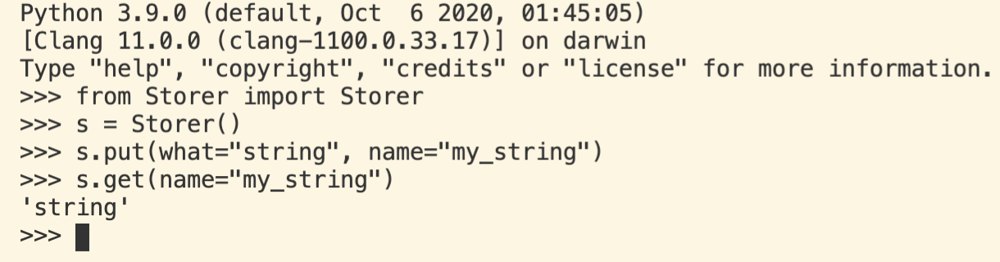
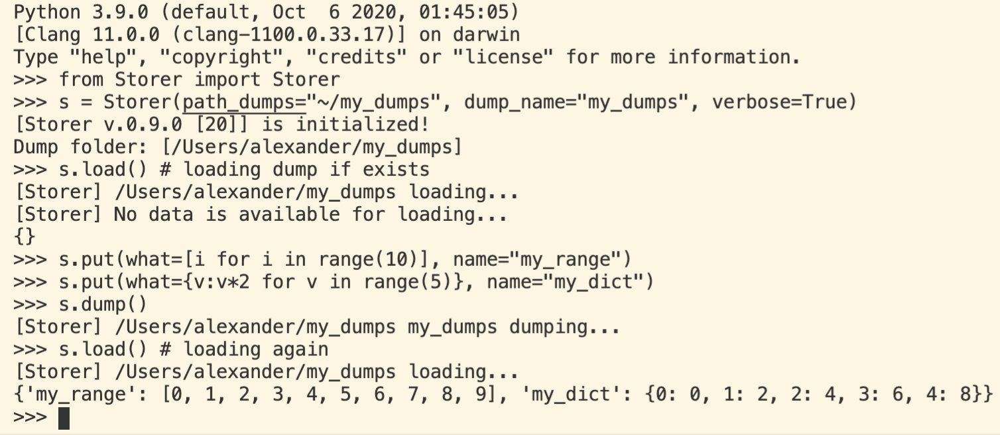

# 1. Storer

- [1. Storer](#1-storer)
  - [1.1. Usage](#11-usage)
  - [1.2. Contribution](#12-contribution)
  - [Future](#future)

Minimalist storage class for any purpose. Created for internal needs. Feel free to use it and contribute (see [contribution section](#12-contribution)).

## 1.1. Usage

Easy to use.

1. Create an Storer instance: `s = Storer()`
2. Put something: `s.put(what=<what_ever_you_like>, name=<name_it>)`
3. Get something: `s.get(name=<name_of_object>)`
4. Look at objects: `s.show()` or `output = s.show(get_string=True)`

Few examples:

## 1.2. Contribution

Feel free to contribute to the project, but please create initially an issue with detailed problem and way to resolve it. 

## Future 

 - extend file formats for storing
 - ...
